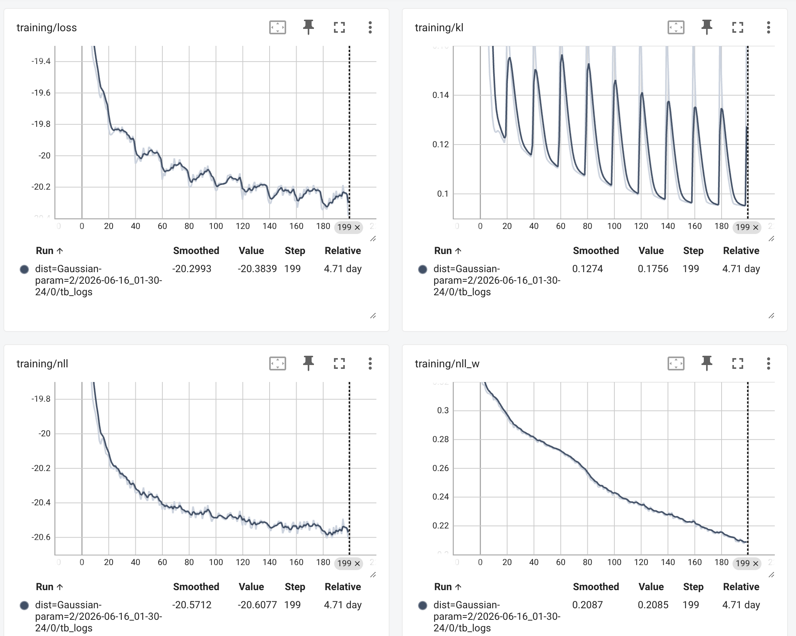

This is the official repository of two papers:

- Neural Multichannel Distant Speaker Diarization and Source Separation with Beta Speaker Activity Prior (Interspeech 2026)
- Neural Multichannel Distant Speaker Diarization with Heavy-tailed Source Separation Model (IEEE SLT 2026)

The repository contains the training and inference code for the two papers. We will release the pre-trained models later.

## Environment config
```
pip install -r requirements.txt
```
> I personally prefer to use `uv` to manage the virtual environment, however due to some weird dependency issues, I cannot make it a uv project, so I just fallback to `pip`, the `requirements.txt` obviously contains some redundant packages, but I have no time to clean it up, sorry for that.
> Remember to run `pip install -e .` if you want your custom codes directly available in the environment.

## Pre-trained model checkpoints

## Data preparation
First, download the ami/ali/chime6 corpus and its metadata and configure `dataset_path` , `metadata_path` in `recipes/<dataset>/scripts/config.py`

Then, it is recommended to refer to `recipes/chime6/scripts` or `recipes/ali/scripts` to prepare the data, from `1_split_data.py` to `4_convert_to_hf_dataset.py`. `recipes/ami/scripts` is modified from the original neural FCASA repo and it makes HDF5 dataset first, which has memory leak issues for me so I converted it to HF dataset, which does not directly build HF dataset from plain files.

## Training
We use `hydra` to manage the experiment configurations. The configs are stored in `recipes/<dataset>/models/neural-fcasa/configs`, with a good decomposition into subdirectories, so you might freely add, reuse and compose your own training configs.

To launch training, you can run something like to debug first:
```bash
python train.py --config-path=./config --config-name=train_ddp_debug.yaml model.distribution=Student-t model.dist_param=1 model.beta_prior=False model.beta_prior_m=0.5 model.beta_prior_lmd=4.0
```
then you can run the full training with:
```bash
python train.py --config-path=./config --config-name=train_audible02_resume.yaml model.distribution=Student-t model.dist_param=1 model.beta_prior=False model.beta_prior_m=0.5 model.beta_prior_lmd=4.0
```
> The training is recommended to run on multiple GPUs, normally it requires 4 A100 GPUs to run 3-4 days. I know this is a lot for this 20M parameter model, but c'est la vie. According to Dr. Bando, the original neural FCASA was trained on 8 H100 GPUs ~~with infinite CPU memories (so they just cache them all and never need to worry about memory issues)~~ and it is finished in 24 hours. BTW, on AMI dataset, AMP training is possible on A100. However on AliMeeting and CHiME6, I cannot prevent AMP training from gradient diverging on A100, so I have to disable it, which is another reason for the slow training speed. This is kind of a general painful issue for audio deep learning models.

Of course, if you have access to a SLURM cluster, you can use the `--multirun` option to exploit the `hydra-submitit-launcher` to help you manage the job submission on the cluster with a nice integration of the SLURM system.
```bash
python train.py --multirun --config-path=./config --config-name=train_audible02_resume.yaml
```

During the training, run `tensorboard --logdir=./outputs` to monitor it, you should get the loss curve similar to the following:



## Evaluation
Run `recipes/<dataset>/models/neural-fcasa/6_eval_exp.py` to evaluate the model on the test set, or do the cross-test with `recipes/crosstest/cross_test.py`. We run more tests after the paper submission, and they are available in my doctoral thesis. You might ask me for them after I defend.

## Inference
Sorry but I'm lazy to write a standalone inference script, but I'm sure you/your AI are smart enough to adapt it from the evaluation script :).

# Citation
```bibtex
@misc{mao2026neuralmultichanneldistantspeaker,
      title={Neural Multichannel Distant Speaker Diarization and Source Separation with Beta Speaker Activity Prior}, 
      author={Sicheng Mao and Mathieu Fontaine and Anthony Larcher and Roland Badeau},
      year={2026},
      eprint={2608.28661},
      archivePrefix={arXiv},
      primaryClass={cs.SD},
      url={https://arxiv.org/abs/2608.28661}, 
}
```

Another one is coming.

# Acknowledgement
We thank Dr. Bando for insightful discussions and his valuable work on the original neural FCASA model, which is the baseline of our work. Without him, I can hardly graduate 😂.

# Good luck to your research.

The repository is a fork of the baseline model neural FCASA. The following is the original README of neural FCASA.

<div align="center"></div>


# Neural Blind Source Separation and Diarization for Distant Speech Recognition
This is a repository of neural full-rank spatial covariance analysis with speaker activity (neural FCASA).
Neural FCASA is a method for jointly separating and diarizing speech mixtures without supervision by isolated signals.


## Installation
```bash
pip install git+https://github.com/b-sigpro/neural-fcasa.git
```

## Inference
### Using model pre-trained on the AMI corpus
```bash
python -m neural_fcasa.dereverberate input.wav input_derev.wav
python -m neural_fcasa.separate one hf://b-sigpro/neural-fcasa input_derev.wav output.wav
```

### General usage
#### Dereverberation
```bash
python -m neural_fcasa.dereverberate input.wav output.wav
```

This is just a thin wrapper of `nara_wpe`.
The options are as follows:
* `--n_fft`: Window length of STFT (default=512)
* `--hop_length` Hop length of STFT (default=160)
* `--taps` Tap length of WPE (default=10)
* `--delay` Delay of WPE (default=3)


#### Separation and diarization
```bash
python -m neural_fcasa.separate one /path/to/model/ input.wav output.wav
```

The options are as follows:
* `--thresh`: Threshold to obtain diarization result (default: 0.5)
* `--out_ch`: Output channel index for Wiener filtering (default: 0)
* `--medfilt_size`: Filter size of median postfiltering (default: 11)
* `--dump_diar`: Dump diarization results as a pickle file (default: `false`)
* `--noi_snr`: SNR for white noise added to the separated result. No noise is added with `None`. (default: `None`)
* `--normalize`: Perform normalization of the separated result (default: `false`)
* `--device`: device type (e.g., `cuda` and `cpu`) for inference. (default: `cuda`)

We used the following configuration for the evaluation in the paper:
```bash
python -m neural_fcasa.separate one hf://b-sigpro/neural-fcasa --dump_diar --noi_snr=40 --normalize input.wav output.wav
```


### Limitations
The current inference script has the following limitations, which we are addressing to solve:
* [ ] The # mics. must be the same as that at the training (8).
* [ ] The input length must be less than 50 seconds due to the max. length of the positional encoding (5000).
* [ ] The performance will be maximized by making the input length the same as that at the training (10 seconds).

## Training
The training script is compatible with PyTorch Lightning >= 2.2.3. The training dependencies will be installed by
```bash
pip install -e .[train]
```

The training job script for [AI Bridging Cloud Infrastructure (ABCI)](https://abci.ai/) is attached on [`recipes/ami/`](https://github.com/b-sigpro/neural-fcasa/tree/main/recipes/neural-fcasa).

0. Prepare a singularity container and place it as `recipes/singularity/singularity.sif`

1. Move to the recipe directory
    ```bash
    cd recipes/ami/
    ```

2. Download the ami corpus and its metadata and configure `dataset_path` and `metadata_path` in `scripts/config.yaml`

3. Split audio files with the following command and with the submitted job to finish:
    ```bash
    ./scripts/1_split_data.py sub
    ```

4. Split speaker activities:
    ```bash
    ./scripts/2_split_activations.py sub
    ```

5. Dereverberate audio files
    ```bash
    ./scripts/3_dereverberate.py sub
    ```

6. Make HDF5
    ```bash
    ./scripts/4_make_dataset_chunk.py sub
    ```
    Please make sure that you are using h5py capable of parallel HDF5

7. Submit training job
    ```bash
    ./models/neural-fcasa/train.sh -q
    ```

## Reference
```bibtex
@inproceedings{bando2023neural,
  title={Neural Blind Source Separation and Diarization for Distant Speech Recognition},
  author={Yoshiaki Bando and Tomohiko Nakamura and Shinji Watanabe},
  booktitle={accepted for INTERSPEECH},
  year={2024}
}
```

## Acknowledgement
This work is based on results obtained from a project, Programs for Bridging the gap between R&D and the IDeal society (society 5.0) and Generating Economic and social value (BRIDGE)/Practical Global Research in the AI × Robotics Services, implemented by the Cabinet Office, Government of Japan.
